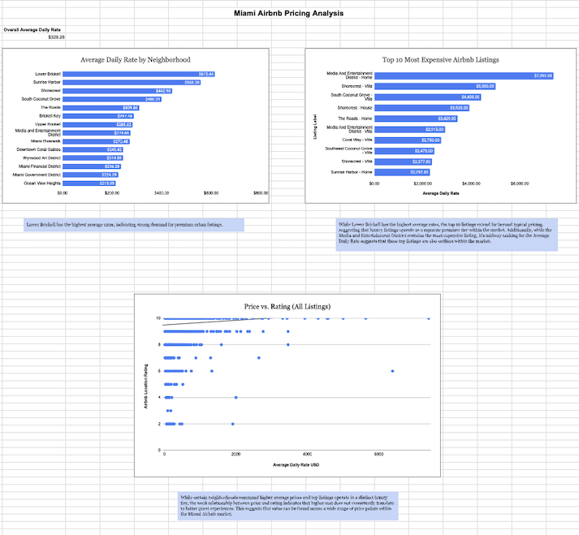
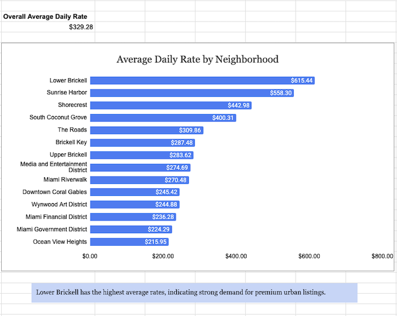

# miami-airbnb-pricing-analysis
SQL and Google Sheets analysis of Airbnb pricing trends in Miami

# Miami Airbnb Pricing Analysis

## Objective
Analyze pricing trends, identify high-end listings, and evaluate whether price correlates with listing quality.

## Tools Used
- SQL (MySQL)
- Google Sheets

## Key Insights
- Higher-priced neighborhoods (e.g., Lower Brickell) show strong demand
- Top listings operate in a distinct luxury pricing tier
- Price has a weak relationship with rating, indicating value exists across price ranges

## Visual Dashboard

## Live Visual Dashboard
[View Google Sheets Dashboard](https://docs.google.com/spreadsheets/d/1dpsMhqErmDmynSZ25qAMzpMrxzl7Mfiycgv7WGzhOfI/edit?usp=sharing)

