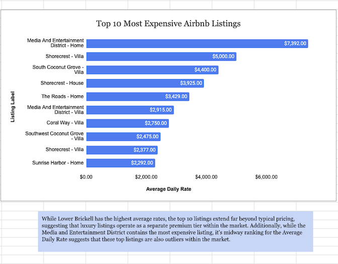
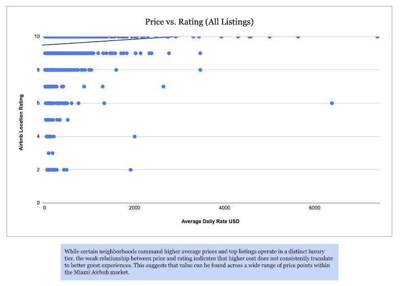

# miami-airbnb-pricing-analysis
SQL and Google Sheets analysis of Airbnb pricing trends in Miami

# Miami Airbnb Pricing Analysis

## Objective
Analyze pricing trends, identify high-end listings, and evaluate whether price correlates with listing quality.

## Key Insights
- Higher-priced neighborhoods (e.g., Lower Brickell) show strong demand
- Top listings operate in a distinct luxury pricing tier
- Price has a weak relationship with rating, indicating value exists across price ranges

## Tools Used
- SQL (MySQL)
- Google Sheets
- Data Cleaning & Aggregation
- Data Visualization

## Data
- Dataset includes 10,000+ Airbnb listings
- Cleaned dataset available in /data folder
- Raw dataset not included due to size (sample provided)

## Sample SQL Query
```sql
-- Average Price by Neighborhood
SELECT 
    Neighborhood, 
    ROUND(AVG(Average_Daily_Rate_USD),2) AS Avg_Price
FROM miamidata
WHERE Neighborhood IS NOT NULL
GROUP BY Neighborhood
ORDER BY Avg_Price DESC;

```
## Live Visual Dashboard
[View Google Sheets Dashboard](https://docs.google.com/spreadsheets/d/1x_ZEdtdO7WMuxt4OwJKCm5ptbhzmXxragdp1iqpHdMg/edit?usp=sharing)

## Visual Dashboard






## Full SQL Queries
See analysis_queries.sql in /SQL for all queries in this project


